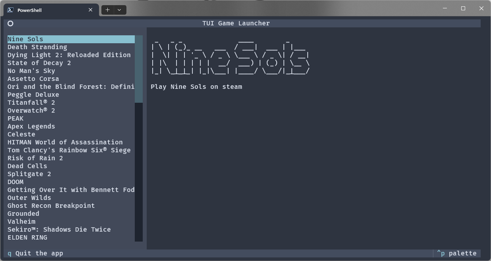

# GameTUI

GameTUI is a terminal-based game launcher designed for people who prefer speed, simplicity, and a keyboard-first interface. It provides a clean TUI (Text User Interface) for browsing and launching your games directly from the terminal. Written in python. 

## Features
- Only Windows support for now
- Simple, scrollable game list
- Keyboard navigation with responsive controls
- Lightweight and fast
- Steam and epic library suport (more soon)

## Screenshot




## Installation

Clone the repository and install the dependencies:

```bash
git clone https://github.com/Nikirack/GameTUI.git
cd GameTUI
pip install -r requirements.txt
```

Made using python 3.13

## Usage

Run the launcher with:

```bash
cd src
python main.py
```

### Keyboard Controls

-   Arrow keys or j and k: Navigate up and down the list
    
-   Enter: Launch selected game
    
-   `q`: Quit the app
    
-   `Ctrl+P`: Open command palette

-  You can launch a games or change the theme using the command palette
   

## Roadmap

Planned features for future updates include:
    
- Support for other libraries like GOG and EA
    
-  Support for custom games

- Support for linux and MacOS

## Author

Created by [Nikirack](https://github.com/nikirack).  Contributions and feedback are always welcome.